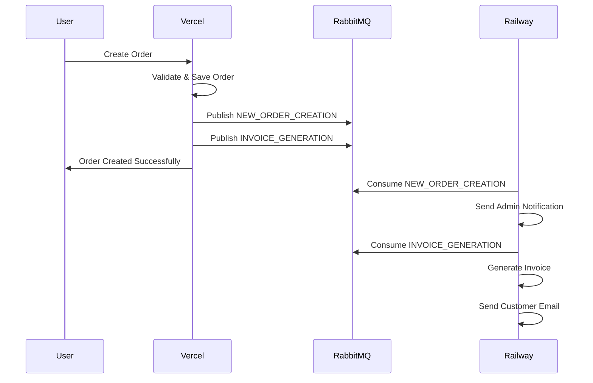

# Vercel + Railway Architecture Guide

## Overview

This architecture separates concerns between your main application (Vercel) and background processing (Railway):

- **Vercel (Main App)**: Handles web requests, order creation, and publishes events to RabbitMQ
- **Railway (Consumers)**: Processes background tasks like email notifications and invoice generation

## Architecture Diagram

```
┌─────────────────┐    RabbitMQ     ┌─────────────────┐
│                 │   Events        │                 │
│   Vercel App    │ ──────────────► │ Railway Consumers│
│                 │                 │                 │
│ • Order Creation│                 │ • Email Notifications│
│ • User Interface│                 │ • Invoice Generation│
│ • API Routes    │                 │ • Admin Alerts   │
└─────────────────┘                 └─────────────────┘
```

## Setup Instructions

### 1. Vercel Deployment (Main App)

#### Environment Variables Required:
```bash
# Database
MONGODB_URI=your_mongodb_connection_string

# RabbitMQ (for publishing events)
RABBITMQ_URL=your_rabbitmq_connection_string

# Email (for Railway consumers)
SMTP_HOST=your_smtp_host
SMTP_PORT=587
SMTP_USER=your_smtp_user
SMTP_PASS=your_smtp_password

# Other required variables
NEXTAUTH_SECRET=your_nextauth_secret
NEXTAUTH_URL=https://your-vercel-app.vercel.app
```

#### Vercel Configuration:
- **AUTO_START_CONSUMERS**: Set to `false` (consumers run on Railway)
- **RABBITMQ_URL**: Must be configured for event publishing
- **Functions**: Max duration set to 30 seconds

### 2. Railway Deployment (Consumers)

#### Environment Variables Required:
```bash
# Database (same as Vercel)
MONGODB_URI=your_mongodb_connection_string

# RabbitMQ (same as Vercel)
RABBITMQ_URL=your_rabbitmq_connection_string

# Email Configuration
SMTP_HOST=your_smtp_host
SMTP_PORT=587
SMTP_USER=your_smtp_user
SMTP_PASS=your_smtp_password

# Admin Email
ADMIN_EMAIL=admin@yourdomain.com

# Cloudinary (for invoice storage)
CLOUDINARY_CLOUD_NAME=your_cloud_name
CLOUDINARY_API_KEY=your_api_key
CLOUDINARY_API_SECRET=your_api_secret
```

#### Railway Configuration:
- **Start Command**: `tsx start-consumers.ts`
- **Health Check**: `/health`
- **Restart Policy**: On failure with max 10 retries

## Event Flow

### 1. Order Creation Flow



### 2. Event Types

| Event Type | Publisher | Consumer | Action |
|------------|-----------|----------|---------|
| `NEW_ORDER_CREATION` | Vercel | Railway | Send admin notification email |
| `INVOICE_GENERATION` | Vercel | Railway | Generate PDF invoice, send customer email |
| `LOW_STOCK_ALERT` | Vercel | Railway | Send low stock notifications |
| `NEW_CUSTOMER_REGISTRATION` | Vercel | Railway | Send welcome email |
| `NEW_PRODUCT_CREATION` | Vercel | Railway | Send product creation notifications |

## API Endpoints

### Vercel (Main App)

#### Order Management
- `POST /api/orders` - Create new order (publishes events)
- `GET /api/orders` - Get user orders
- `GET /api/orders/[id]` - Get specific order
- `GET /api/orders/[id]/invoice` - Get invoice status
- `POST /api/orders/[id]/invoice` - Trigger invoice generation

#### Health & Status
- `GET /api/startup` - Application startup status
- `GET /api/test` - Test API functionality

### Railway (Consumers)

#### Health Check
- `GET /health` - Consumer health status
- `GET /` - Consumer status page

## Deployment Steps

### Step 1: Deploy to Vercel

1. **Connect Repository**: Link your GitHub repository to Vercel
2. **Set Environment Variables**: Add all required environment variables
3. **Deploy**: Vercel will automatically deploy your app
4. **Verify**: Check that orders can be created without errors

### Step 2: Deploy to Railway

1. **Create New Project**: Create a new Railway project
2. **Connect Repository**: Link the same repository
3. **Set Root Directory**: Set to `railway-consumers/`
4. **Set Environment Variables**: Add all required environment variables
5. **Deploy**: Railway will start the consumers
6. **Verify**: Check health endpoint and logs

### Step 3: Test Integration

1. **Create Test Order**: Create an order on Vercel
2. **Check Vercel Logs**: Verify events are published
3. **Check Railway Logs**: Verify events are consumed
4. **Check Email**: Verify admin and customer emails are sent
5. **Check Invoice**: Verify invoice is generated and downloadable

## Monitoring & Debugging

### Vercel Monitoring
- **Function Logs**: Check Vercel dashboard for function logs
- **Error Tracking**: Monitor for any API errors
- **Performance**: Check function execution times

### Railway Monitoring
- **Application Logs**: Check Railway dashboard for consumer logs
- **Health Checks**: Monitor health endpoint
- **Resource Usage**: Check CPU and memory usage

### Common Issues & Solutions

#### Issue: Events not being published
**Solution**: 
- Check `RABBITMQ_URL` is set in Vercel
- Verify RabbitMQ connection string is correct
- Check Vercel function logs for errors

#### Issue: Events not being consumed
**Solution**:
- Check Railway deployment is running
- Verify `RABBITMQ_URL` is set in Railway
- Check Railway logs for connection errors

#### Issue: Emails not being sent
**Solution**:
- Verify SMTP credentials in Railway
- Check email service logs
- Test SMTP connection

#### Issue: Invoices not being generated
**Solution**:
- Check Cloudinary credentials in Railway
- Verify invoice generation logs
- Check file permissions

## Scaling Considerations

### Vercel Scaling
- **Automatic**: Vercel automatically scales based on traffic
- **Function Limits**: 30-second max duration per function
- **Concurrent Limits**: Based on your Vercel plan

### Railway Scaling
- **Manual**: Scale Railway instances based on queue load
- **Resource Limits**: Monitor CPU and memory usage
- **Queue Management**: Consider multiple consumer instances for high volume

## Security Considerations

### Environment Variables
- **Never commit**: Keep all sensitive data in environment variables
- **Separate Environments**: Use different credentials for dev/staging/prod
- **Regular Rotation**: Rotate credentials regularly

### Network Security
- **RabbitMQ**: Use secure connection strings
- **Database**: Use connection strings with authentication
- **Email**: Use secure SMTP with authentication

## Cost Optimization

### Vercel
- **Function Usage**: Monitor function execution time and frequency
- **Bandwidth**: Monitor data transfer
- **Edge Functions**: Consider edge functions for better performance

### Railway
- **Resource Usage**: Monitor CPU and memory usage
- **Uptime**: Ensure consumers are running efficiently
- **Queue Processing**: Optimize consumer processing time

## Backup & Recovery

### Database
- **Regular Backups**: Set up automated MongoDB backups
- **Point-in-time Recovery**: Ensure backup strategy covers data loss scenarios

### RabbitMQ
- **Message Persistence**: Ensure messages are persisted
- **Queue Durability**: Configure durable queues
- **Dead Letter Queues**: Set up for failed message handling

## Maintenance

### Regular Tasks
- **Monitor Logs**: Check both Vercel and Railway logs regularly
- **Update Dependencies**: Keep dependencies updated
- **Test Integration**: Regularly test the full flow
- **Performance Review**: Monitor and optimize performance

### Updates
- **Deploy Order**: Always deploy Railway consumers first, then Vercel
- **Environment Variables**: Update both environments simultaneously
- **Testing**: Test in staging before production deployment
